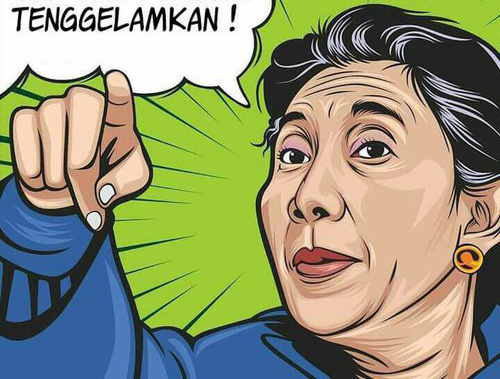

# Tenggelamkan!: Sebuah Proyek Sistem Cerdas

Tenggelamkan! adalah permainan menembak kapal ilegal yang mengambil ikan di negara tercinta kita, Negara Indonesia. Disini user akan berlawanan dengan AI yang berperan sebagai nelayan ilegal dan kita bertugas menenggelamkan mereka sebelum mereka menenggelamkan kita. Game ini terinspirasi dari Menteri Kelautan dan Perikanan Ibu Susi Pudjiastuti, yang bersikap tegas terhadap nelayan yang tidak bertanggung jawab.

## Starting the game

Run *main.py* using python3 and have fun! :)

## Authors

**Tim Anak Intelligent**  
Mochamad Aulia Akbar Praditomo (1606827145)  
Fajrin Maulana Kingwijati (1606837631)  
Tirta Hema (1606879602)